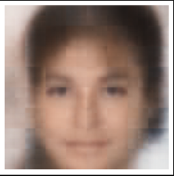

## Autoencoders - HW_2

The task was to implement and train different types of autoencoder architectures such as autoecoder (AE), variational autoencoder (VAE), and convolutional variational autoencoder (ConvVAE). Mnist and Celeba datasets were used for training mentioned models. The following results are provided for the Celeba part of the assignment.

What Celeba dataset looks like (center crop 128x128 pixels):

The results of Convolutional VAE generation:

As could have been expected, results are better than just a simple bayesian generation. We don't see any artifacts or randomly placed pixels, and yet we didn't avoid all known simple autoencoders main problem - the pictures look blurry, especially the background part.
