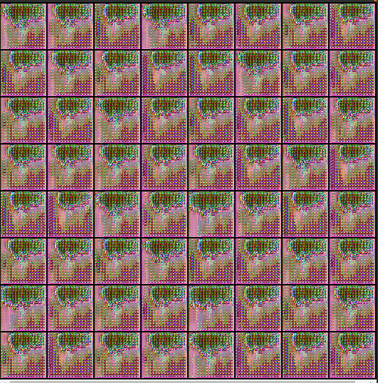
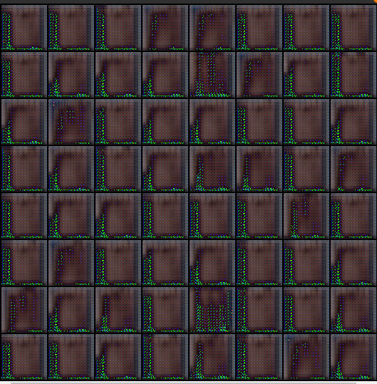
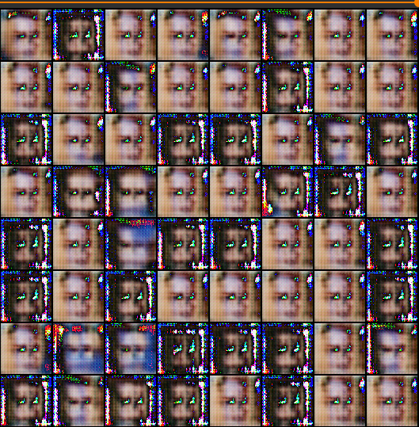
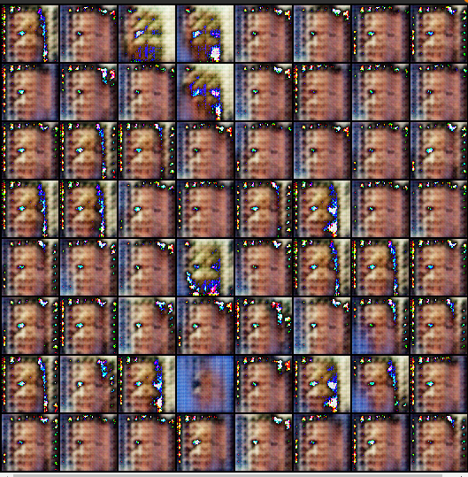

# GANs-HomeWork

Результат работы DCGAN после 10 эпох обучения:  

Для CSPGAN долго не удавалось добиться сходимости и хоть каких-то результатов, генератор выдавал что-то подобное прикрепленной ниже картинке постоянно (какие-то пиксельные рисунки различных форм и цветов). Я предполагаю, что мы попадали в ситуацию, когда генератор обманывал дискриминатор, при этом генерировав картинки, мягко говоря, совсем не из распределения лиц:

После увеличения скорости обучения для дискриминатора модель начала генерировать что-то более осмысленное (представлены скриншоты промежуточных стадий обучения):

Уже что-то, а не просто шум и специфические пиксель арты, однако на второй и третьей картинках уже можно заметить, что наблюдается что-то похожее на модколлапс. В ноутбуке представлена визуализация работы модели, к сожалению, качество генерации оставляет желать лучшего, но хотя бы что-то похожее на лица (правда из фильмов ужасов, но это мелочи).
