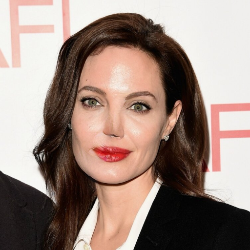
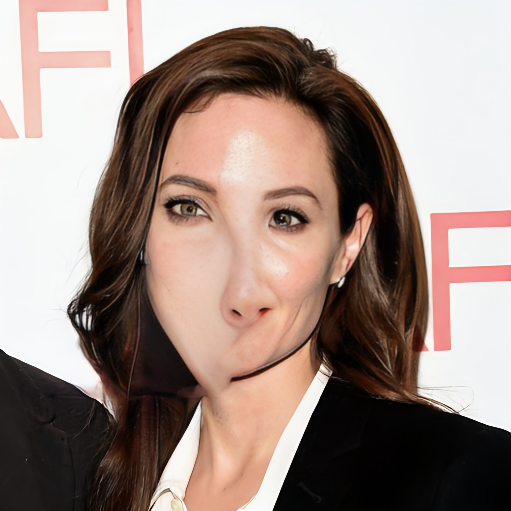

# GANs-HomeWork
### Попытка покадровой дорисовки с помощью MAT

Веса Celeba:

Веса FFHQ:

### Эксперименты с меньшими масками на одной фотографии:

Оригинал:

Маски №1 и №2:

Восстановление от MAT (веса CelebA):

Восстановление от MAT (веса FFHQ):

Восстановление от GPEN:

Восстановление от MAT (веса FFHQ) кажется несколько лучше, чем MAT (веса CelebA), и значительно лучше, чем GPEN, поэтому дальнейшие эксперименты было решено проводить с фотографией, восстановленной MAT (веса FFHQ).

Улучшение от GPEN после восстановление MAT (веса FFHQ):

Картинка стала красивее, более яркой, увеличилось разрешение, немного добавился макияж, но улучшение не затронуло недочеты предшествующего восстановления от MAT.

Замена лица от SimSwap:

# Вывод:

На данный момент библиотека MAT не показывает заявленных результатов для инпэйнтинга или, по крайней мере, мне не удалось достичь подобных результатов, где закрыто маской более 80% лица и происходит качественное восстановление. В README показаны неудачные попытки покадрово восстановить видео с помощью MAT с весами моделей, натренированных на датасетах CelebA и FFHQ, а также небольщой пул экспериментов с восстановлением одной фотографии с масками меньшего размера при помощи библиотек MAT и GPEN и последующим улучшением от GPEN Enhancement, и пересадкой лица от SimSwap. Библиотека для пересадки лица показывает хорошее качество, учитывая, что мы пересаживали одно и тоже лицо, но с разных фотографий. Полученное изображение выглядит довольно хорошо, повторно улучшить его с помощью GPEN Enhancement не получилось из-за ошибки рантайма, по всей видимости библиотека всегда увеличивает входное разрешение изображения вне зависимости от исходного. Во второй раз на вход уже подавалось разрешение 2048x2048, а не 512x512 как в первый раз. В связи с этим, для дальнейшего улучшения полученных изображений предлагается использовать GPEN Enhancement после SimSwap, а не до.
