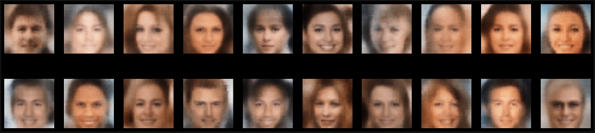

# Generative-Approaches

## Bayes Generation - HW_1

The avatars:

The task was to develop an algorithm that would choose each pixel's RGB-values with probabilities we had previously counted on the set of avatar pictures. The result of the algorithm:

Since the algorithm doesn't take into account that neigbouring pixels suppose to correlate and actually depend on each other, the resulting avatar looks in a certain way, proving that this particular type of generation isn't the best option for picture generation.
 

## Autoencoders - HW_2

The task was to implement and train different types of autoencoder architectures such as autoecoder (AE), variational autoencoder (VAE), and convolutional variational autoencoder (ConvVAE). Mnist and Celeba datasets were used for training mentioned models. The following results are provided for the Celeba part of the assignment.

What Celeba dataset looks like (center crop 128x128 pixels):

The results of Convolutional VAE generation:

As could have been expected, results are better than just a simple bayesian generation. We don't see any artifacts or randomly placed pixels, and yet we didn't avoid all known simple autoencoders main problem - the pictures look blurry, especially the background part.

### GANs - HW_3

The task was to train a DCGAN architecure and implement and train until convergence a knew GAN architecture which was supposed to be based on DCGAN but altered with CSP-blocks used in a generator network. Celeba dataset (64 x 64 pixels) was used for training. The results of a DCGAN performance after 10 epochs of training:

