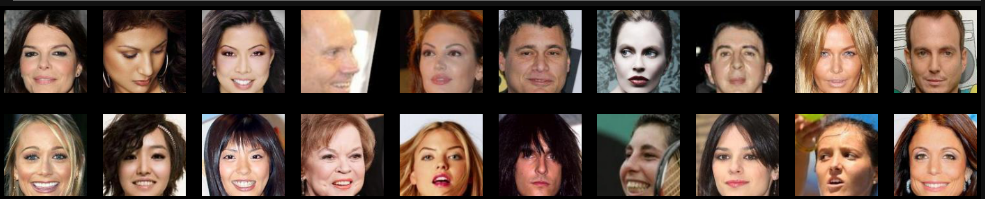

# Generative-Approaches

## Bayes Generation - HW_1

The task was to develop an algorithm that would choose each pixel's RGB-values with probabilities we had previously counted on the set of avatar pictures.

The avatars:

The result of the algorithm:

Since the algorithm doesn't take into account that neigbouring pixels suppose to correlate and actually depend on each other, the resulting avatar looks in a certain way, proving that this particular type of generation isn't the best option for picture generation.
 

## Autoencoders - HW_2

The task was to implement and train different types of autoencoder architectures such as autoecoder (AE), variational autoencoder (VAE), and convolutional variational autoencoder (ConvVAE). MNIST and CelebA datasets were used for training mentioned models. The following results are provided for the CelebA part of the assignment.

What CelebA dataset looks like (center crop 128x128 pixels):

The results of Convolutional VAE generation:

As could have been expected, results are better than just a simple bayesian generation. We don't see any artifacts or randomly placed pixels, and yet we didn't avoid all known simple autoencoders main problem - the pictures look blurry, especially the background part.

## GANs - HW_3

The task was to train a DCGAN architecure and implement and train until convergence a knew GAN architecture which was supposed to be based on DCGAN but altered with CSP-blocks used in a generator network. The CelebA dataset (64 x 64 pixels) was used for training. The results of a DCGAN performance after 10 epochs of training:

However, the new architecture didn't work out that great. It was really hard to achieve any signs of convergeance and whatever I got didn't particulary fit what had been expected:

Although faces can be seen, it mostly looks like a beginning of a mode collapse, a known problem in generative adversarial approach.

## Inpainting - HW_4

The task was to research and try different pretrained networks for picture inpainting/inhancement. Such networks as MAT and GPEN were used for the assignment. The original picture, masked pictures and results as follows:

Original picture:

Masks №1 & №2:

MAT inpainting (CelebA weights):

MAT inpainting (FFHQ weights):

GPEN inpainting:

MAT inpainting (FFHQ weights) seems to be slightly better than MAT (CelebA weights) and a lot better than GPEN inpainting. Further experiments were conducted on the 1st masked picture after MAT inpainting (FFHQ weights).

GPEN inhancement after MAT inpainting (FFHQ weights):

The picture got brighter, the resolution got higher. It looks like some make up was added, but GPEN inhancement did't improve any previous inpainting errors such as with nose area and slight lips asymmetry.
